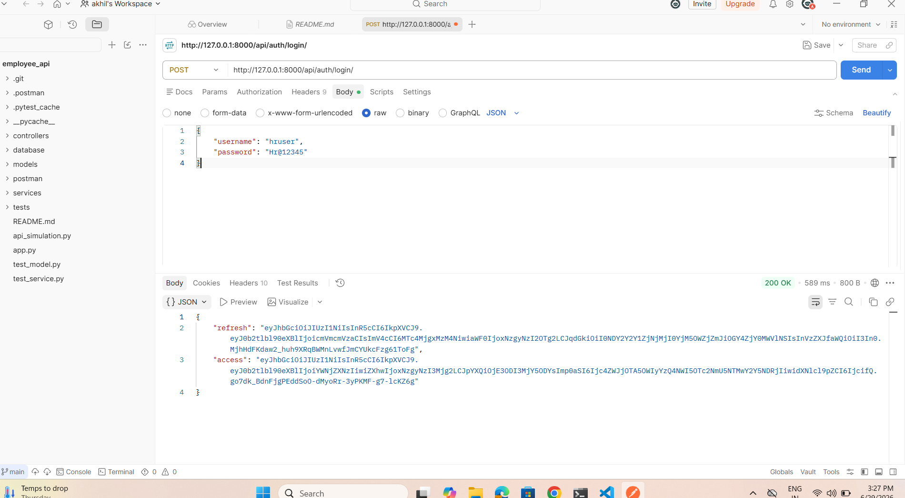
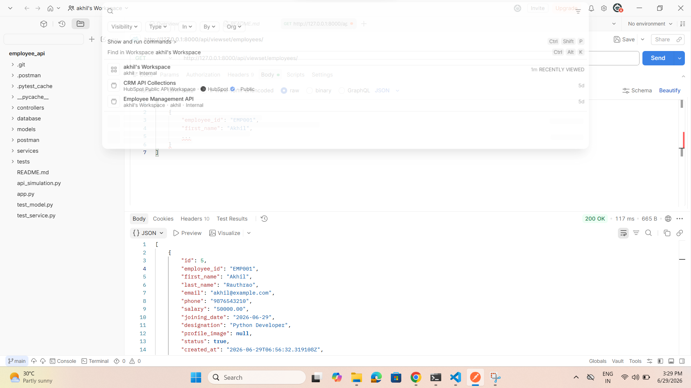

# Company Employee Portal REST API

## Project Overview

The Company Employee Portal REST API is a backend application built using Django REST Framework (DRF) and PostgreSQL. It provides secure REST APIs for managing employees and departments with JWT Authentication and Role-Based Access Control (RBAC). The project follows a professional Git workflow using feature branches and Pull Requests.

---

## Features

* Django REST Framework (DRF)
* PostgreSQL Database Integration
* Custom User Model
* JWT Authentication (Simple JWT)
* Employee CRUD APIs
* Function-Based APIs
* Class-Based APIs (APIView)
* Generic Views
* ViewSets & Routers
* Role-Based Access Control (HR & Employee)
* Django Admin Panel
* REST API Testing using Postman

---

## Technologies Used

* Python 3.14
* Django
* Django REST Framework
* PostgreSQL
* Simple JWT
* Postman
* Git
* GitHub

---

## Project Structure

```text
company_portal/
│
├── accounts/
├── api/
│   ├── serializers.py
│   ├── class_views.py
│   ├── generic_views.py
│   ├── viewsets.py
│   ├── auth_urls.py
│   ├── urls.py
│   └── views.py
│
├── employees/
├── company_portal/
├── screenshots/
│   ├── jwt-login.png
│   └── employee-api.png
│
├── manage.py
├── requirements.txt
└── README.md
```

---

## Installation

### Clone Repository

```bash
git clone <repository-url>
cd company_portal
```

### Install Dependencies

```bash
pip install -r requirements.txt
```

### Apply Migrations

```bash
python manage.py makemigrations
python manage.py migrate
```

### Create Superuser

```bash
python manage.py createsuperuser
```

### Run the Project

```bash
python manage.py runserver
```

Open your browser:

```
http://127.0.0.1:8000/
```

Django Admin:

```
http://127.0.0.1:8000/admin/
```

---

## API Endpoints

### Authentication APIs

| Method | Endpoint           |
| ------ | ------------------ |
| POST   | /api/auth/login/   |
| POST   | /api/auth/refresh/ |

### Employee APIs (ViewSet)

| Method | Endpoint                     |
| ------ | ---------------------------- |
| GET    | /api/viewset/employees/      |
| POST   | /api/viewset/employees/      |
| GET    | /api/viewset/employees/{id}/ |
| PUT    | /api/viewset/employees/{id}/ |
| DELETE | /api/viewset/employees/{id}/ |

### Generic View APIs

| Method | Endpoint                     |
| ------ | ---------------------------- |
| GET    | /api/generic/employees/      |
| POST   | /api/generic/employees/      |
| GET    | /api/generic/employees/{id}/ |
| PUT    | /api/generic/employees/{id}/ |
| DELETE | /api/generic/employees/{id}/ |

---

## Authentication

JWT Authentication is implemented using **djangorestframework-simplejwt**.

Login API returns:

```json
{
    "refresh": "your_refresh_token",
    "access": "your_access_token"
}
```

The access token is used to access protected APIs.

---

## User Roles

### HR

* Create Employees
* Update Employees
* Delete Employees
* View Employees

### Employee

* View Employee Details

---

## Testing

The following APIs were tested successfully using Postman:

* JWT Login API
* Employee CRUD APIs
* Generic View APIs
* ViewSet APIs

---

## Git Workflow

```bash
git checkout development
git pull origin development
git checkout -b feature/drf-api-development
```

Commit:

```bash
git commit -m "feat: implement Django REST Framework APIs"
```

Push:

```bash
git push origin feature/drf-api-development
```

Create a Pull Request from:

* Base: `development`
* Compare: `feature/drf-api-development`

---

## Screenshots

### JWT Authentication



---

### Employee API Response



---

## Author

**Rauthrao Akhil**

GitHub: https://github.com/Akhil8374
